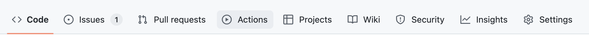
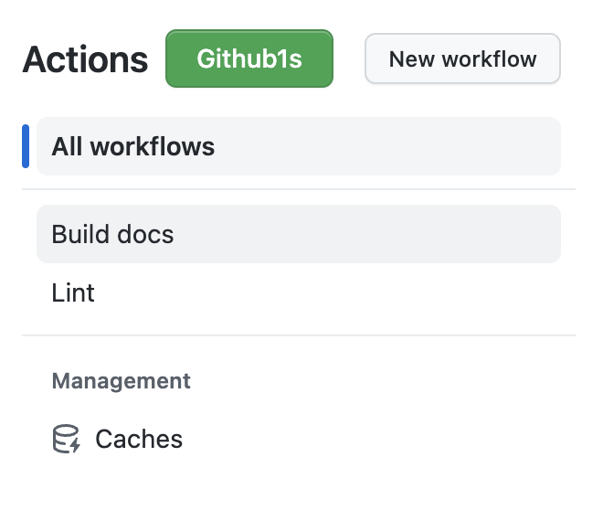
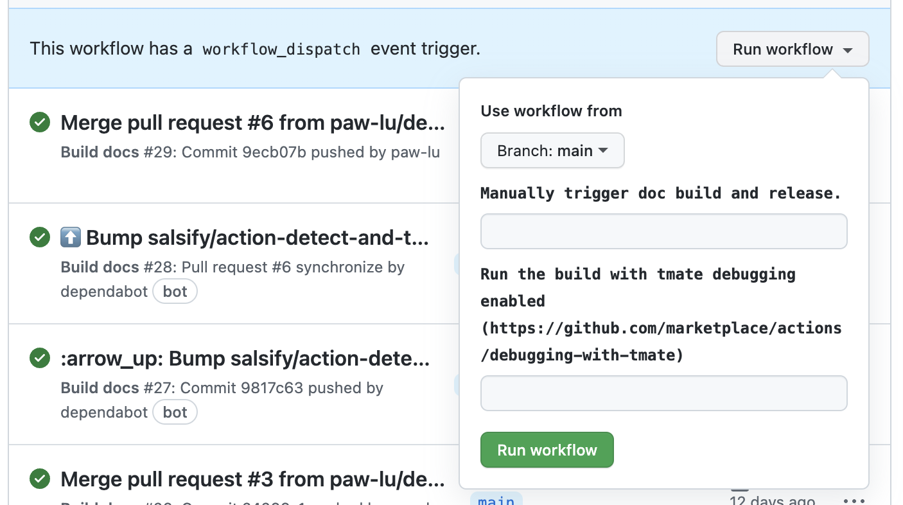
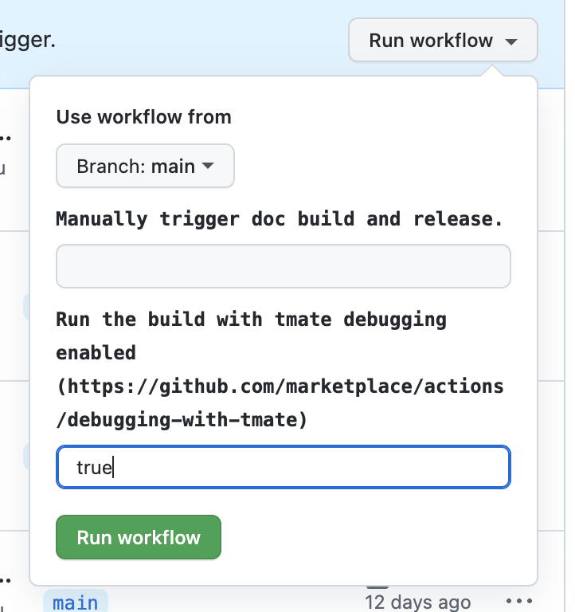

# Advanced GitHub actions features

## Debugging GitHub action runs

GitHub actions can be tricky to debug when documentation fails to build,
which is why cookiecutter dash docset includes [mxschmitt/action-tmate](https://github.com/mxschmitt/action-tmate).

The action will print out a command
that allows you to ssh into the action environment
so that you can debug failed runs.

??? question "How do I trigger a GitHub Actions workflow dispatch?"

    Go to the :octicons-play-16: `Actions` section of your repository.

    

    Select the `Build docs` workflow.

    

    Select `Run workflow`.

    

    Fill in the variables needed
    and click `Run workflow`
    to launch the new run.
    If we want to launch the tmate debugging session—
    we can fill in `true` under `Run the build with tmate debugging enabled`.

    

By default,
a debugging session will run if `Build docs` is triggered on a workflow dispatch,
`Run the build with tmate debugging enabled` is set to `true`,
and a failure occurs in the actions steps.

## Manually triggering a documentation build

A new version release of the documentation's library
signals to this project
that the docset is new
and should be contributed to [Kapeli/Dash-User-Contributions](https://github.com/Kapeli/Dash-User-Contributions).
You can also trigger this event manually.
Similarly to [**Debugging GitHub action runs**](#debugging-github-action-runs),
launching an action via workflow dispatch
with `Manually trigger doc build and release.` set to `true`
will force the contribution steps to run
regardless of whether the library version has changed.

This is useful for when you initially create your repository
and want to immediately contribute a new docset
without having to wait for a new release.
