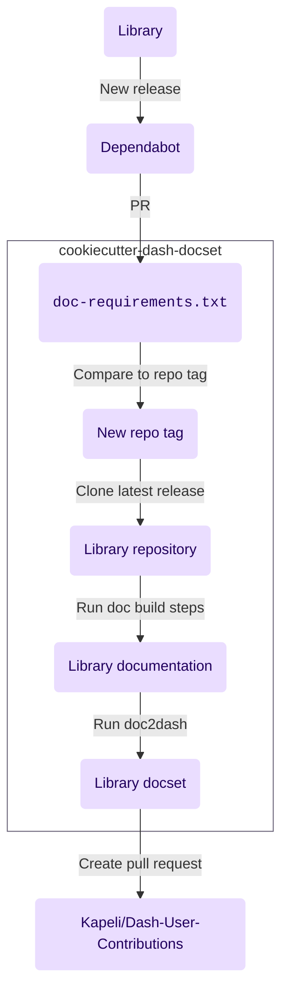

# How it works

Cookiecutter Dash documentation sets automates
building a library's documentation sets
and uploading it to the user contribution repository
each time a new version of the library releases.

This template sets up the following chain of triggers:

1. A new version of the library is released
2. [Dependabot](https://github.com/dependabot)
   create a pull request against the repository,
   which will trigger a build check on [GitHub Actions]
   to verify that the docs correctly build.
3. The pull request will modify the library version in `./doc-requirements.txt`.
   This version will be compared against the current repository tag
   to verify that it has changed.
4. If the version has changed,
   the commit is tagged with the newer version.
5. A new tagged commit
   triggers the newest release of the library to be cloned.
6. After cloning,
   the doc build steps are ran.
7. [doc2dash] is ran against the build documentation to create the documentation set
8. A pull request is generated for [Kapeli/Dash-User-Contributions]
   with the new documentation set.

[doc2dash]: https://doc2dash.readthedocs.io/en/stable
[github actions]: https://github.com/features/actions
[kapeli/dash-user-contributions]: https://github.com/Kapeli/Dash-User-Contributions
