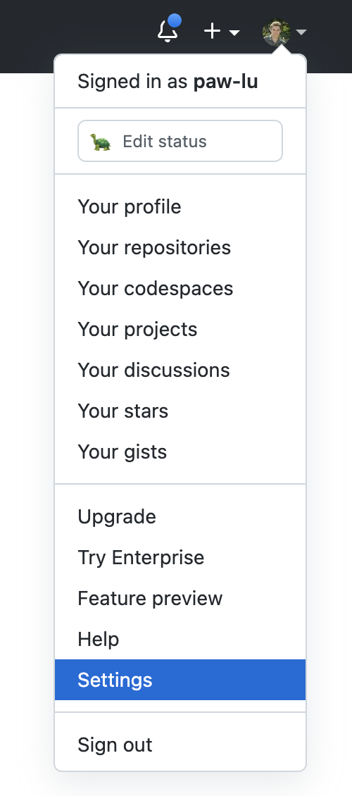
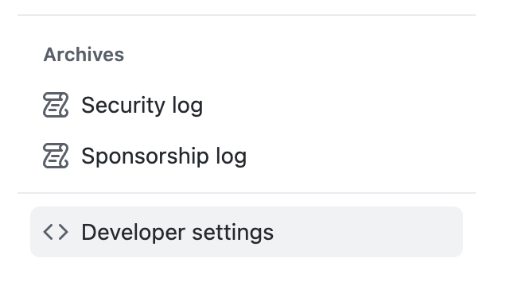
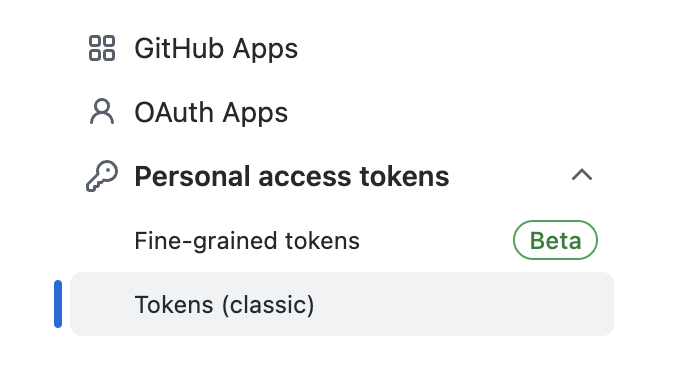
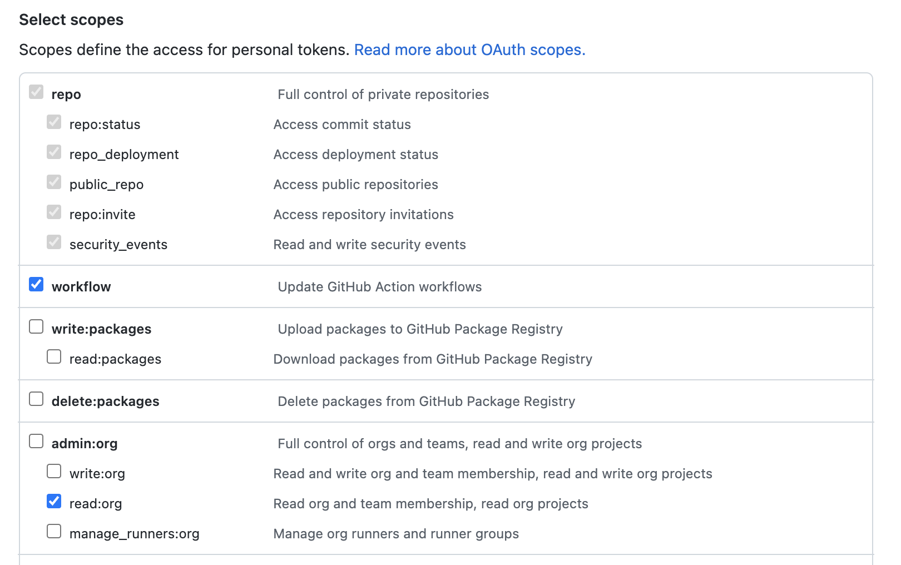
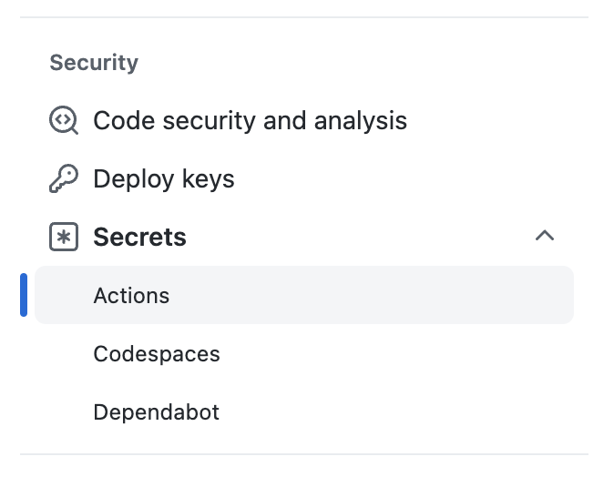
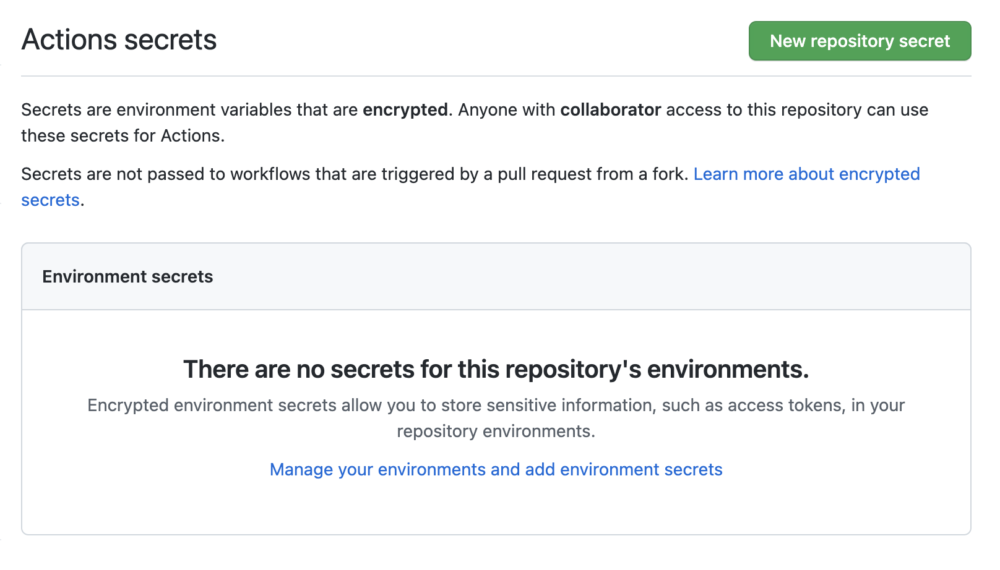
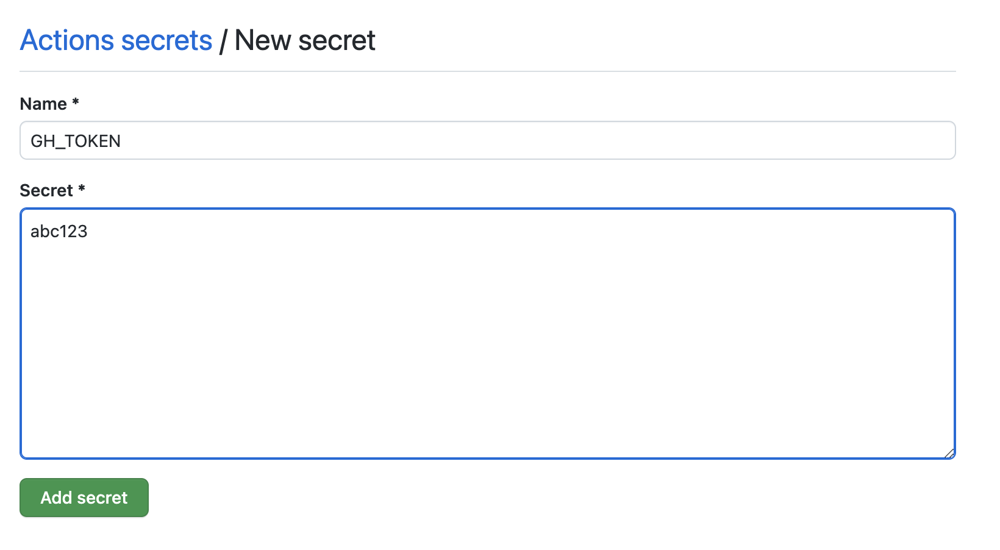
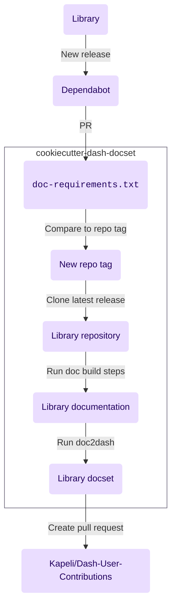

# Cookiecutter Dash docset

A [cookiecutter] template
for automating the generation of [documentation sets](https://developer.apple.com/library/archive/documentation/DeveloperTools/Conceptual/Documentation_Sets/010-Overview_of_Documentation_Sets/docset_overview.html#//apple_ref/doc/uid/TP40005266-CH13-SW6)
for use in [Dash] compatible API browsers using
[doc2dash]
and contributing to [Kapeli/Dash-User-Contributions].

## What is this project?


[Dash][^1] is an app that lets you instantly search through documentation sets offline.
[Hynek Schlawack has a great writeup on the benefits of using Dash.](https://hynek.me/articles/productive-fruit-fly-programmer/)
If you find yourself
with dozen of documentation tabs open
or repeatedly searching for the same APIs,
[Dash] might be useful for you.

[Dash] comes with a few documentation sets,
but if a library isn't included
[you can always generate your own documentation set](https://kapeli.com/docsets).[^2]
To make your generated documentation sets available to others
you can contribute them to [Kapeli/Dash-User-Contributions].

However,
if you want to keep things up to date,
each time new version of a library releases
you need to:

1. Clone the library
2. Reinstall the dependencies
3. Rebuild the docs
4. Convert the docs to a Dash-compatible documentation set
5. Create a pull request for [Kapeli/Dash-User-Contributions]

This is tedious.
As a result,
many documentation sets don't keep up with their library's release.

Cookiecutter Dash docset
generates a repository that automates this process.
After generating the project
[and modifying the template in a couple of key areas](#generating-the-project),
you should have a repository that specifies the entire docset building process
and automatically re-runs it on [GitHub Actions] with a new release of the library.

## Features

- Automates the creation of library documentation sets
- Automatically detects new library release
- Generates pull requests against dash
- Provides checks to see if build stale

## Generating the project

[Cookiecutter] must be installed
in order to generate this project.

??? question "How to install [cookiecutter]"

    You can install cookiecutter using [homebrew](https://brew.sh/)

    ```console
    % brew install cookiecutter
    ```

    or [pipx](https://pypa.github.io/pipx/)

    ```console
    % pipx install cookiecutter
    ```

    [Cookiecutter's documents some more detailed installation instructions.](https://cookiecutter.readthedocs.io/en/stable/installation.html#installation)

Once cookiecutter is installed,
run:

```console
% cookiecutter https://github.com/paw-lu/cookiecutter-dash-docset
```

You'll get some prompts asking you questions about the generated project:

| Variable                  | Description                                                                                                                                   | Example                          |
| ------------------------- | --------------------------------------------------------------------------------------------------------------------------------------------- | -------------------------------- |
| `library_name`            | The name of the library you will generate a docset for.                                                                                       | `pip`                            |
| `library_repository_name` | The name of the repository on GitHub for the library. By default set equal to `library_name`.                                                 | `pip`                            |
| `installable_name`        | The name of the installable for the library. The thing you would type in when you `pip install`. By default set to `library_repository_name`. | `pip`                            |
| `library_version`         | The version of the library to build the docs from.                                                                                            | `22.3`                           |
| `library_owner`           | The GitHub owner name of the repository for the library.                                                                                      | `pypa`                           |
| `github_username`         | Your GitHub username.                                                                                                                         | `paw-lu`                         |
| `your_name`               | Your name.                                                                                                                                    | `Paulo S. Costa`                 |
| `project_name`            | The name of the generated project. By default `{library_repository_name}-dash-docset`                                                         | `pip-dash-docset`                |
| `documentation_url`       | The url the library's documentation is hosted at.                                                                                             | `https://pip.pypa.io/en/stable/` |
| `python_version`          | The python version which will run the build script.                                                                                           | `3.10`                           |

## Requirements

If you plan on running this project only through GitHub actions,
nothing needs to be installed

## Getting started

### Modifying the template's `noxfile.py`

??? question "What's a `noxfile` and what's [nox]?"

    [nox] is a command line tool for automating the building of environments
    and running actions.
    Cookiecutter dash docset uses it
    to install the dependencies needed to build the documentation
    and run the build commands.

    There are 2–3 methods you will use:

    1. [`Session.install`](https://nox.thea.codes/en/stable/config.html#nox.sessions.Session.install)
       runs pip commands in the environment created by [nox].
       So if creating your doc-building environment requires you to run:

        ```console
        % pip install .
        % pip install --requirement=docs/requirements.txt
        ```

        This would translate to:

        ```python
        session.install(".")
        session.install("--requirement=docs/requirements.txt")
        ```

     2. [Session.chdir]
        Changes the current working directory.

     3. [`Session.run`](https://nox.thea.codes/en/stable/config.html#nox.sessions.Session.run)
        Runs a command in the environment created by [nox].
        If building your docs requires you to run:

         ```console
         % cd docs
         % make html
         ```

         We'll use [Session.chdir] to translate this to:

         ```python
         with session.chdir("docs"):
            session.run("make", "html")
         ```

At least two modifications will need to be made to the template in `./noxfile.py`.
First,
specify the build steps for the library's documentation
by modifying `docs`.

!!! warning

    Both of the functions you need to modify in `noxfile.py`—`docs`
    and `icon`—have
    `NotImplimented` errors in them by default
    as a reminder to the user to make some changes to them.
    This will cause nox to fail by default.
    Remove them once you have completed your changes.

```python title="./noxfile.py"
--8<-- "{{cookiecutter.project_name}}/noxfile.py:docs"
```

1. This line is here
   to make sure you modify the code below
   to build the docs for your specific library.
   Remove it after you're done.
2. Here you typically install the package locally
3. Here you install
   the extra requirements needed to build the docs themselves—maybe
   sphinx, mkdocs, etc
4. Finally you run the command that builds the docs

Second,
specify the correct path to an icon
relative to the library's repository root.

```python title="./noxfile.py"
--8<-- "{{cookiecutter.project_name}}/noxfile.py:icon"
```

1. This line is here
   to make sure you modify the path below
   to point to the icon for your library.
   Remove it after you're done.
2. Replace this line
   with a path pointing towards an image
   that can be used as the icon for your documentation.
   The path should start from the name of the
   directory containing the repository.
   When you generate the project using [cookiecutter],
   `{{ cookiecutter.library_repository_name }}` will automatically be replaced
   by the repository directory name.

### Add `GH_TOKEN` as a repository secret

??? question "How to create a GitHub token"

    Under your profile.
    Go to `Settings`.

    

    Select :octicons-code-16: `Developer settings`

    

    Select :octicons-key-16: `Tokens`.

    

    Finally,
    select the scoped of your token.

    

Cookiecutter dash docset needs a GitHub token
to create commits and pull requests on our behalf.
Create a GitHub token with the following scopes:

<!-- prettier-ignore -->
- [x] **repo**
    - [x] repo:status
    - [x] repo_deployment
    - [x] public_repo
    - [x] repo:invite
- [x] security_events
- [x] **workflow**
- [ ] **admin:org**
    - [ ] write:org
    - [x] read:org
    - [ ] manage_runners:org

??? question "How to add a GitHub repository secret"

    On your GitHub repository,
    go to the :octicons-gear-16: `Settings`

    

    Under :octicons-key-asterisk-16: `Secrets`,
    select `Actions`.

    

    Create a repository secret
    by clicking `New repository secret`.

    

    Paste your token and name it `GH_TOKEN`.

    

Add this token as a GitHub repository secret
named `GH_TOKEN`.

### Install additional dependencies in `.github/workflows/build_docs.yml`

!!! note

    This step is only needed
    if building the documentation
    requires dependencies that cannot be `pip` installed by [nox]

Additionally,
if there are additional non-python dependencies needed to build the docs
add the installation steps in `.github/actions/build_docs.yml`.

```yaml title=".github/workflows/build_docs.yml"
--8<-- "{{cookiecutter.project_name}}/.github/workflows/build_docs.yml:dependencies"
```

1.  Here we could install extra dependencies
    needed to build the docs.
    For example,
    if we need pandoc,
    we can install it via the [`r-lib/actions/setup-pandoc@v2`](https://github.com/r-lib/actions/tree/v2/setup-pandoc) action.

    ```yaml
    - name: Setup pandoc
      id: setup-pandoc
      uses: r-lib/actions/setup-pandoc@v2
      with:
        pandoc-version: "2.17.1"
    ```

## How it works

Cookiecutter Dash documentation sets automates
building a library's documentation sets
and uploading it to the user contribution repository
each time a new version of the library releases.



This template sets up the following chain of triggers:

1. A new version of the library is released
2. [Dependabot](https://github.com/dependabot)
   create a pull request against the repository,
   which will trigger a build check on [GitHub Actions]
   to verify that the docs correctly build.
3. The pull request will modify the library version in `./doc-requirements.txt`.
   This version will be compared against the current repository tag
   to verify that it has changed.
4. If the version has changed,
   the commit is tagged with the newer version.
5. A new tagged commit
   triggers the newest release of the library to be cloned.
6. After cloning,
   the doc build steps are ran.
7. [doc2dash] is ran against the build documentation to create the documentation set
8. A pull request is generated for [Kapeli/Dash-User-Contributions]
   with the new documentation set.

[^1]:
    There are multiple alternatives as well—like
    [Zeal](https://zealdocs.org/),
    [Velocity](https://velocity.silverlakesoftware.com/),
    [Helm Dash](https://github.com/dash-docs-el/helm-dash),
    and [dasht](https://github.com/sunaku/dasht)

[^2]: Tools like [doc2dash] help automate some of the generation.

[cookiecutter]: https://github.com/cookiecutter/cookiecutter
[dash]: https://kapeli.com/dash
[doc2dash]: https://doc2dash.readthedocs.io/en/stable
[github actions]: https://github.com/features/actions
[kapeli/dash-user-contributions]: https://github.com/Kapeli/Dash-User-Contributions
[nox]: https://nox.thea.codes/en/stable/
[session.chdir]: https://nox.thea.codes/en/stable/config.html#nox.sessions.Session.chdir
