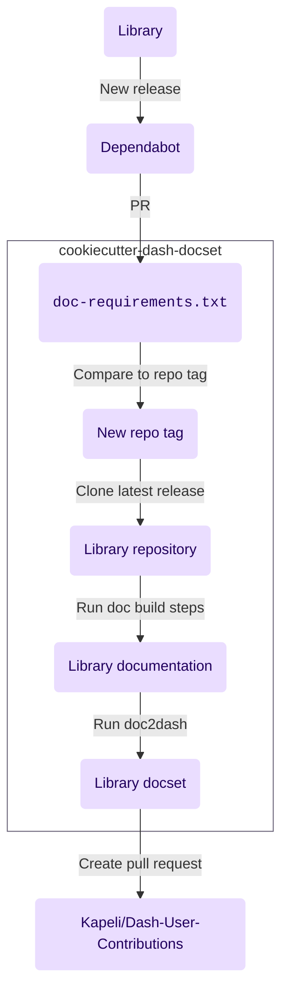

# Cookiecutter Dash docset

A [cookiecutter] template
for automating the generation of [documentation sets](https://developer.apple.com/library/archive/documentation/DeveloperTools/Conceptual/Documentation_Sets/010-Overview_of_Documentation_Sets/docset_overview.html#//apple_ref/doc/uid/TP40005266-CH13-SW6)
for use in [Dash] compatible API browsers using
[doc2dash]
and contributing to [Kapeli/Dash-User-Contributions].

## What is this project?


[Dash][^1] is an app that lets you instantly search through documentation sets offline.
[Hynek Schlawack has a great writeup on the benefits of using Dash.](https://hynek.me/articles/productive-fruit-fly-programmer/)
If you find yourself
with dozen documentation tabs open
and repeatedly searching for how to use the same APIs,
[Dash] might be useful for you.

[Dash] comes with quite a few documentation sets,
[but you can generate your own as well](https://kapeli.com/docsets).[^2]
To make your generated documentation sets available to others
you can contribute them to [Kapeli/Dash-User-Contributions].

However,
if you want to keep things up to date,
when a new version of a library releases
you need to:

1. Clone the library
2. Reinstall the dependencies
3. Rebuild the docs
4. Convert the docs to a Dash-compatible documentation set
5. Create a pull request for [Kapeli/Dash-User-Contributions]

This is tedious.
As a result,
many documentation sets don't keep up with their library's release.

Cookiecutter Dash docset
generates a repository that automates this process.
After generating the project
[and modifying the template in a couple of key areas](#generating-the-project),
you should have a repository that automates the docset building process
and automatically re-runs it on [GitHub Actions] with a new release of the library.

## Features

- Automates the creation of library docsets
- Automatically detects new library release
- Generates pull requests against dash
- Provides checks to see if build stale

## Requirements

## Getting started

### Generating the project

First,
generate your project by running:

```console
% cookiecutter https://github.com/paw-lu/cookiecutter-dash-docset
```

### Modifying the template

At least two modifications will need to be made to the template in `./noxfile.py`.
First,
specify the build steps for the library's documentation
by modifying `docs`.

!!! warning

    Both of the functions you need to modify in `noxfile.py`—`docs`
    and `icon`—have
    `NotImplimented` errors in them by default
    as a reminder to the user to make some changes to them.
    This will cause nox to fail by default.
    Remove them once you have completed your changes.

```python title="./noxfile.py"
--8<-- "{{cookiecutter.project_name}}/noxfile.py:docs"
```

1. This line is here
   to make sure you modify the code below
   to build the docs for your specific library.
   Remove it after you're done.
2. Here you typically install the package locally
3. Here you install
   the extra requirements needed to build the docs themselves—maybe
   sphinx, mkdocs, etc
4. Finally you run the command that builds the docs

Second,
specify the correct path to an icon
relative to the library's repository root.

```python title="./noxfile.py"
--8<-- "{{cookiecutter.project_name}}/noxfile.py:icon"
```

1. This line is here
   to make sure you modify the path below
   to point to the icon for your library.
   Remove it after you're done.
2. Replace this line
   with a path pointing towards an image
   that can be used as the icon for your documentation.
   The path should start from the name of the
   directory containing the repository.
   When you generate the project using [cookiecutter],
   `{{ cookiecutter.library_repository_name }}` will automatically be replaced
   by the repository directory name.

### Add a repository secret

Create a repository secret named `GH_TOKEN` with permissions:

### Install additional dependencies in GitHub actions

This step may not be needed.

Additionally,
if there are additional non-python dependencies needed to build the docs
add the installation steps in `.github/actions/build_docs.yml`

## How it works

Cookiecutter Dash docset automates
building a library's docset
and uploading it to the user contribution repository
each time a new version of the library releases.



This template sets up the following chain of triggers:

1. A new version of the library is released
2. [Dependabot](https://github.com/dependabot)
   create a pull request against the repository,
   which will trigger a build check on [GitHub Actions]
   to verify that the docs correctly build.
3. The pull request will modify the library version in `./doc-requirements.txt`.
   This version will be compared against the current repository tag
   to verify that it has changed.
4. If the version has changed,
   the commit is tagged with the newer version.
5. A new tagged commit
   triggers the newest release of the library to be cloned.
6. After cloning,
   the doc build steps are ran.
7. [doc2dash] is ran against the build documentation to create the docset
8. A pull request is generated for [Kapeli/Dash-User-Contributions]
   with the new docset.

[cookiecutter]: (https://github.com/cookiecutter/cookiecutter)
[doc2dash]: https://doc2dash.readthedocs.io/en/stable/
[kapeli/dash-user-contributions]: (https://github.com/Kapeli/Dash-User-Contributions)
