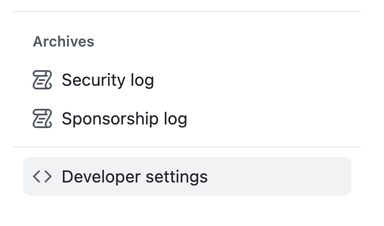
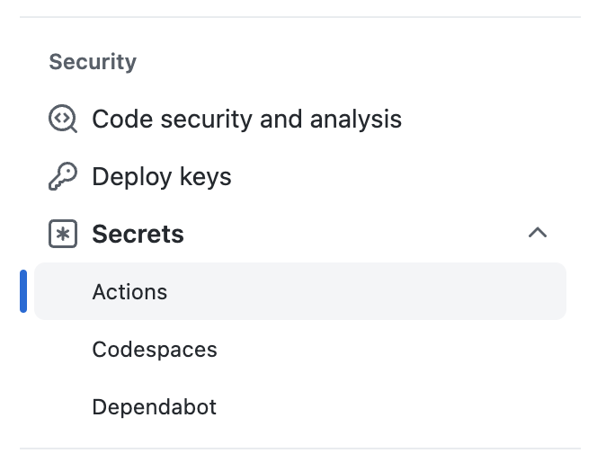
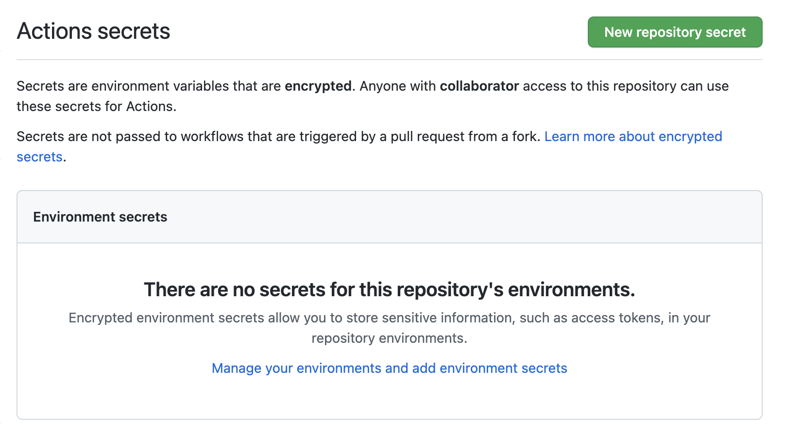
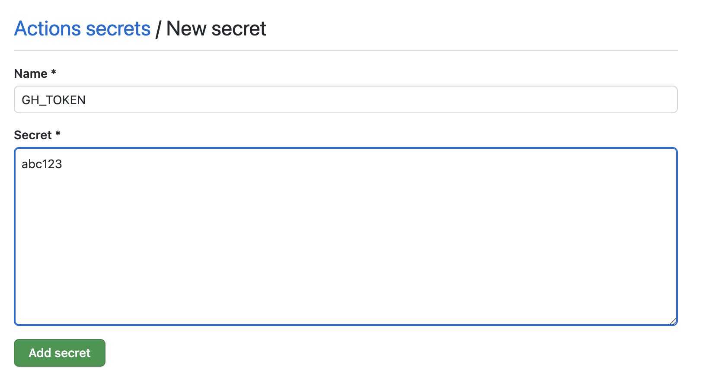

# Modifying the project

## Modifying the template's `noxfile.py`

??? question "What's a `noxfile` and what's [nox]?"

    [nox] is a command line tool for automating the building of environments
    and running actions.
    Cookiecutter dash docset uses it
    to install the dependencies needed to build the documentation
    and run the build commands.

    There are 2–3 methods you will use:

    1. [`Session.install`](https://nox.thea.codes/en/stable/config.html#nox.sessions.Session.install)
       runs pip commands in the environment created by [nox].
       So if creating your doc-building environment requires you to run:

        ```console
        % pip install .
        % pip install --requirement=docs/requirements.txt
        ```

        This would translate to:

        ```python
        session.install(".")
        session.install("--requirement=docs/requirements.txt")
        ```

     2. [Session.chdir]
        Changes the current working directory.

     3. [`Session.run`](https://nox.thea.codes/en/stable/config.html#nox.sessions.Session.run)
        Runs a command in the environment created by [nox].
        If building your docs requires you to run:

         ```console
         % cd docs
         % make html
         ```

         We'll use [Session.chdir] to translate this to:

         ```python
         with session.chdir("docs"):
            session.run("make", "html")
         ```

At least two modifications will need to be made to the template in `./noxfile.py`.
First,
specify the build steps for the library's documentation
by modifying `docs`.

!!! warning

    Both of the functions you need to modify in `noxfile.py`—`docs`
    and `icon`—have
    `NotImplimented` errors in them by default
    as a reminder to the user to make some changes to them.
    This will cause nox to fail by default.
    Remove them once you have completed your changes.

```python title="./noxfile.py"
--8<-- "{{cookiecutter.project_name}}/noxfile.py:docs"
```

1. This line is here
   to make sure you modify the code below
   to build the docs for your specific library.
   Remove it after you're done.
2. Here you typically install the package locally
3. Here you install
   the extra requirements needed to build the docs themselves—maybe
   sphinx, mkdocs, etc
4. Finally you run the command that builds the docs

Second,
specify the correct path to an icon
relative to the library's repository root.

```python title="./noxfile.py"
--8<-- "{{cookiecutter.project_name}}/noxfile.py:icon"
```

1. This line is here
   to make sure you modify the path below
   to point to the icon for your library.
   Remove it after you're done.
2. Replace this line
   with a path pointing towards an image
   that can be used as the icon for your documentation.
   The path should start from the name of the
   directory containing the repository.
   When you generate the project using [cookiecutter],
   `{{ cookiecutter.library_repository_name }}` will automatically be replaced
   by the repository directory name.

### Add `GH_TOKEN` as a repository secret

??? question "How to create a GitHub token"

    Under your profile.
    Go to `Settings`.

    

    Select :octicons-code-16: `Developer settings`

    

    Select :octicons-key-16: `Tokens`.

    

    Finally,
    select the scoped of your token.

    

Cookiecutter dash docset needs a GitHub token
to create commits and pull requests on our behalf.
Create a GitHub token with the following scopes:

<!-- prettier-ignore -->
- [x] **repo**
    - [x] repo:status
    - [x] repo_deployment
    - [x] public_repo
    - [x] repo:invite
- [x] security_events
- [x] **workflow**
- [ ] **admin:org**
    - [ ] write:org
    - [x] read:org
    - [ ] manage_runners:org

??? question "How to add a GitHub repository secret"

    On your GitHub repository,
    go to the :octicons-gear-16: `Settings`

    

    Under :octicons-key-asterisk-16: `Secrets`,
    select `Actions`.

    

    Create a repository secret
    by clicking `New repository secret`.

    

    Paste your token and name it `GH_TOKEN`.

    

Add this token as a GitHub repository secret
named `GH_TOKEN`.

## Install additional dependencies in `.github/workflows/build_docs.yml`

!!! note

    This step is only needed
    if building the documentation
    requires dependencies that cannot be `pip` installed by [nox]

If there are additional non-python dependencies needed to build the docs
add the installation steps in `.github/actions/build_docs.yml`.

```yaml title=".github/workflows/build_docs.yml"
--8<-- "{{cookiecutter.project_name}}/.github/workflows/build_docs.yml:dependencies"
```

1.  Here we could install extra dependencies
    needed to build the docs.
    For example,
    if we need pandoc,
    we can install it via the [`r-lib/actions/setup-pandoc@v2`](https://github.com/r-lib/actions/tree/v2/setup-pandoc) action.

    ```yaml
    - name: Setup pandoc
      id: setup-pandoc
      uses: r-lib/actions/setup-pandoc@v2
      with:
        pandoc-version: "2.17.1"
    ```

[nox]: https://nox.thea.codes/en/stable/
[session.chdir]: https://nox.thea.codes/en/stable/config.html#nox.sessions.Session.chdir
